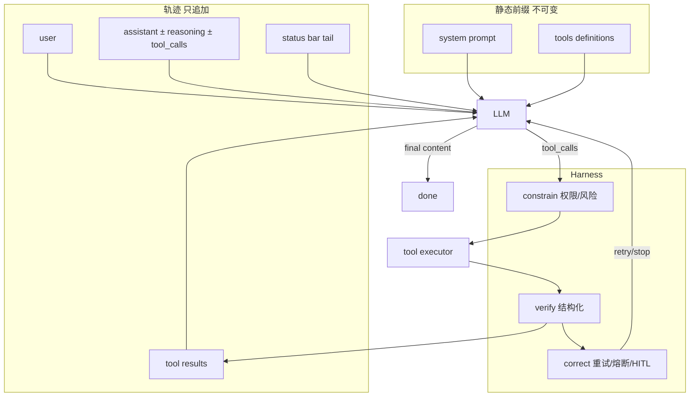

# Ch1–Ch2 能力清单：生产 Agent Runtime（TypeScript / Next.js）

来源：`ai-agent-book` 第 1 章（公式 / ReAct / Harness / 编排 / 护栏）、第 2 章（上下文工程 / API 消息 / Skills / 状态栏 / 压缩）。

目标：在本仓库落地可运行的 Agent runtime，模块建议根路径 `src/lib/agent/`。  
本文件只列**可实现、可证伪**的能力，不实现代码。

**公式（书）**

```text
最小：Agent = LLM + 上下文 + 工具
生产：Agent = Model + Harness
       Harness = 上下文 + 工具 + 约束 + 验证 + 纠正
上下文 = 静态前缀(system + tools) + 轨迹(user/assistant/tool)
```

**现有目录对齐**

| 已有 | 建议用途 |
|------|----------|
| `src/lib/agent/providers/` | 模型客户端、Chat Completions / Responses 适配 |
| `src/lib/agent/tools/` | 工具注册、schema、执行、权限 |
| `src/lib/agent/skills/` | SKILL.md 扫描、元数据、按需加载 |
| `src/lib/agent/memory/` | 会话轨迹持久化、压缩产物 |
| `src/lib/agent/eval/` | 消融 / 回归验收 |
| `src/lib/agent/multi/` | 子 Agent 隔离、派发 |
| （新建）`loop/` `context/` `status/` `compress/` `guardrails/` `harness/` | 见下表各行 |

**优先级**

| 级 | 含义 |
|----|------|
| P0 | 没有就不能叫 Agent runtime（ReAct + 消息正确 + 停机） |
| P1 | 生产可用（缓存友好、状态栏、Skills、护栏、压缩） |
| P2 | 增强 / 规模化（分层压缩、子 Agent 隔离、时间感策略、tool_search） |

---

## 1. 消息与轨迹模型

### 1.1 四种消息角色 + tools 字段

| 字段 | 内容 |
|------|------|
| **原则** | 上下文五件套 = `system` / `user` / `assistant` / `tool` + 请求顶层 `tools`（非消息角色） |
| **验收** | 构造一次带工具的请求，序列化后恰好含四类 role；`tools` 不在 messages 内；无 tools 时模型无法发起合法 tool_calls |
| **路径** | `src/lib/agent/context/messages.ts` |
| **优先级** | P0 |

### 1.2 静态前缀 + 轨迹

| 字段 | 内容 |
|------|------|
| **原则** | 每次 LLM 调用：`上下文 = (system + tool definitions) + trajectory`；轨迹只追加不回写 system |
| **验收** | 同一 session 连续 3 轮后，`system` 与 `tools` 字节级与首轮相同；仅 messages 尾部增长 |
| **路径** | `src/lib/agent/context/session.ts` |
| **优先级** | P0 |

### 1.3 Assistant 三部件

| 字段 | 内容 |
|------|------|
| **原则** | assistant 可含 `reasoning` / `content` / `tool_calls`；工具轮通常 reasoning+tool_calls，终答 reasoning+content |
| **验收** | 类型允许三字段任意子集；工具轮 `content` 可为 null；终答无 `tool_calls` 时循环退出 |
| **路径** | `src/lib/agent/context/messages.ts` |
| **优先级** | P0 |

### 1.4 tool_call_id 关联

| 字段 | 内容 |
|------|------|
| **原则** | 每条 tool 消息必须用 `tool_call_id` 对齐 assistant.tool_calls[].id |
| **验收** | 模型返回 2 个 tool_calls 时，回传 2 条 tool 消息且 id 一一对应；缺 id 时拒绝入轨迹并记错 |
| **路径** | `src/lib/agent/loop/tool-results.ts` |
| **优先级** | P0 |

### 1.5 无状态全量历史回传

| 字段 | 内容 |
|------|------|
| **原则** | 每次 API 调用须带完整历史（含上一轮 assistant.tool_calls 原样） |
| **验收** | 第 2 次请求的 messages 前缀 ⊇ 第 1 次完整 messages；assistant 的 tool_calls JSON 与上一响应字节一致（允许 provider 规范化后的规范形式） |
| **路径** | `src/lib/agent/loop/react-loop.ts` |
| **优先级** | P0 |

### 1.6 禁止自拼纯文本对话

| 字段 | 内容 |
|------|------|
| **原则** | 必须用标准 role 消息；禁止 `"USER: ... ASSISTANT: ..."` 字符串拼进 content 冒充多轮 |
| **验收** | lint / 单测：消息构造 API 无「整段 transcript 字符串」入口；tool 结果 role 必须是 `tool` 而非 `user` |
| **路径** | `src/lib/agent/context/messages.ts` |
| **优先级** | P0 |

---

## 2. ReAct 核心循环

### 2.1 请求 → tool_calls → 执行 → 回传 → 再请求

| 字段 | 内容 |
|------|------|
| **原则** | 模型决策工具与参数；框架执行；结果入轨迹；无 tool_calls 则终答退出 |
| **验收** | 固定 mock 模型序列：第 1 轮 2 个 tool_calls → 框架执行 2 次 → 第 2 轮纯 content 退出；轨迹长度与角色序列可断言 |
| **路径** | `src/lib/agent/loop/react-loop.ts` |
| **优先级** | P0 |

### 2.2 独立工具并行执行

| 字段 | 内容 |
|------|------|
| **原则** | 同一 assistant 消息内无依赖的多个 tool_calls 可并行执行 |
| **验收** | 两个 sleep(100ms) 工具在同一轮请求时，墙钟 < 180ms（串行则 ≥200ms）；依赖参数的工具保持串行（P1 可后加依赖图） |
| **路径** | `src/lib/agent/loop/tool-executor.ts` |
| **优先级** | P0 |

### 2.3 停机条件

| 字段 | 内容 |
|------|------|
| **原则** | 至少：`max_iterations`、无 tool_calls 终答、不可恢复错误；可选最终输出工具 |
| **验收** | mock 永远返回同一 tool_call 时，第 N 轮硬停且不无限 API 调用；终答轮正常 break；工具抛不可恢复错误时退出并带错误事件 |
| **路径** | `src/lib/agent/loop/stop.ts` |
| **优先级** | P0 |

### 2.4 重复工具调用检测（熔断前兆）

| 字段 | 内容 |
|------|------|
| **原则** | 缺 tool result 或失忆会导致无限同一工具；须检测「同名+同参」连续重复 |
| **验收** | 连续 ≥K 次相同 (name, args hash) 时标记 `loop_detected` 并触发纠正策略（停 / 注入状态 / 升级 HITL），不默默烧 token |
| **路径** | `src/lib/agent/harness/circuit-breaker.ts` |
| **优先级** | P1 |

### 2.5 思考 / reasoning 回传策略

| 字段 | 内容 |
|------|------|
| **原则** | Agent 场景思考是状态；按 provider 策略保留或剥离（Claude thinking blocks、DeepSeek V4 强制 reasoning_content 等） |
| **验收** | provider 适配层有显式 `reasoningPolicy: keep | strip | provider_default`；keep 时下一请求含上轮 reasoning 字段；错误策略在集成测试中被 provider 模拟拒绝时有可读错误 |
| **路径** | `src/lib/agent/providers/reasoning.ts` |
| **优先级** | P1 |

---

## 3. 工具系统（动作空间）

### 3.1 工具注册与 OpenAI-style schema

| 字段 | 内容 |
|------|------|
| **原则** | 声明 name / description / parameters；模型只发调用请求，框架执行 |
| **验收** | 注册 1 个工具后请求 `tools[]` 含 JSON Schema；未注册 name 执行返回结构化错误 tool 消息，不崩溃 |
| **路径** | `src/lib/agent/tools/registry.ts` |
| **优先级** | P0 |

### 3.2 工具描述质量（ACI）

| 字段 | 内容 |
|------|------|
| **原则** | 命名直观、参数有例子、写清 NEVER/边界、协作关系（如编辑前先 Read） |
| **验收** | 工具定义校验器：缺 description、缺参数 description、无 example 的高风险工具 → 开发时 fail；至少 1 个参考工具满足书中 Claude Code 风格字段 |
| **路径** | `src/lib/agent/tools/schema.ts` |
| **优先级** | P1 |

### 3.3 通用 vs 专用工具边界

| 字段 | 内容 |
|------|------|
| **原则** | 探索用通用能力（受限 code runner）；支付/删除/发信/部署等高风险用专用工具 + 审计 |
| **验收** | 风险标签 `low|medium|high` 必填；high 默认不可自动执行（见 6.2）；code runner 默认无网、有 cwd 沙盒、timeout/内存/输出上限可配置 |
| **路径** | `src/lib/agent/tools/policy.ts` |
| **优先级** | P1 |

### 3.4 工具定义顺序固定

| 字段 | 内容 |
|------|------|
| **原则** | 禁止按使用频率重排 tools 数组（破坏 Prompt Cache） |
| **验收** | registry 导出顺序稳定（注册序或显式 order 字段）；单测两次 buildRequest 的 tools JSON 字节相等 |
| **路径** | `src/lib/agent/tools/registry.ts` |
| **优先级** | P1 |

### 3.5 延迟加载 / tool_search（可选）

| 字段 | 内容 |
|------|------|
| **原则** | 静态前缀仅工具名+简述；完整 schema 按需追加轨迹末尾，之后固定位置不重搬 |
| **验收** | 启用 defer 时首请求 tools 不含完整 schema；模型 tool_search 后 schema 出现在轨迹固定位置；后续轮次不重复加载同一工具 |
| **路径** | `src/lib/agent/tools/tool-search.ts` |
| **优先级** | P2 |

---

## 4. KV Cache / Prompt Cache 友好布局

### 4.1 静态前缀不可变

| 字段 | 内容 |
|------|------|
| **原则** | system + tools 一旦确定本会话不改；多一空格也算改 |
| **验收** | 会话配置 freeze 后，`mutateSystem()` API 抛错或 no-op+告警；集成测试对比两轮 request 前缀 hash 相同 |
| **路径** | `src/lib/agent/context/prefix.ts` |
| **优先级** | P0 |

### 4.2 动态信息只追加末尾

| 字段 | 内容 |
|------|------|
| **原则** | 时间戳、用户状态、状态栏等永不写进 system；追加为尾部消息 |
| **验收** | 注入 `current_time` 后 system 字符串不变；仅 messages 末尾新增；单元测试禁止 system 模板含 `{{now}}` 实时替换 |
| **路径** | `src/lib/agent/context/append.ts` |
| **优先级** | P0 |

### 4.3 禁止滑动窗口丢前缀一致性

| 字段 | 内容 |
|------|------|
| **原则** | 不得用「只留最近 N 条」当默认历史策略（失忆 + 缓存炸） |
| **验收** | 默认 history 策略 = full 或 compress；`sliding_window` 若存在须 opt-in 且文档标 anti-pattern；测试启用滑动窗口时发出 warning 事件 |
| **路径** | `src/lib/agent/context/history-policy.ts` |
| **优先级** | P1 |

### 4.4 工具结果替换字符串冻结

| 字段 | 内容 |
|------|------|
| **原则** | 大输出替换为摘要后，替换串持久化；会话恢复用同一字节，保缓存键 |
| **验收** | 同一 tool_call_id 的替换预览两次读取相等；重启 session 从 store 恢复后 messages hash 与压缩点一致 |
| **路径** | `src/lib/agent/compress/frozen-preview.ts` |
| **优先级** | P1 |

### 4.5 Prompt Cache 断点（Anthropic 等）

| 字段 | 内容 |
|------|------|
| **原则** | 可跨用户缓存的 system 在前，会话动态在 cache 边界后；条件变体不得放边界前 |
| **验收** | 配置 `cache_control` 时，OS/模式/语言等动态块均在边界后；文档列出 cache key 组成字段 |
| **路径** | `src/lib/agent/providers/cache-control.ts` |
| **优先级** | P2 |

---

## 5. 系统提示与提示工程

### 5.1 结构化 System Prompt

| 字段 | 内容 |
|------|------|
| **原则** | XML 语义块 + Markdown 层次；流程驱动 SOP，非无序规则堆砌 |
| **验收** | 模板支持命名 section；打乱 section 的对照可在 eval 中运行（消融钩子）；生产模板含至少 1 条可执行 SOP（Step 1…N） |
| **路径** | `src/lib/agent/context/system-prompt.ts` |
| **优先级** | P1 |

### 5.2 业务规则可执行化

| 字段 | 内容 |
|------|------|
| **原则** | 模糊裁量改为可判定规则（NEVER… / 阈值映射）；模型不负责发明计费等业务法 |
| **验收** | 规则以数据/配置表达并可单测（输入场景 → 期望计费类型）；提示词由配置渲染，禁止硬编码散落业务 if |
| **路径** | `src/lib/agent/context/business-rules.ts` |
| **优先级** | P1 |

### 5.3 Few-shot 稳定前缀

| 字段 | 内容 |
|------|------|
| **原则** | 示例放 system 或固定伪对话；不按请求动态检索改前缀 |
| **验收** | few-shot 集 ID 绑定任务类型；同任务两次请求示例段 hash 相同 |
| **路径** | `src/lib/agent/context/few-shot.ts` |
| **优先级** | P2 |

---

## 6. Harness：约束 / 验证 / 纠正

### 6.1 约束：故障安全默认关

| 字段 | 内容 |
|------|------|
| **原则** | 能力默认关闭，显式授权才开（类 App 权限） |
| **验收** | 新工具默认 `permission: ask`；未授权执行被拦截并产生 tool 错误结果或 HITL 事件，不静默成功 |
| **路径** | `src/lib/agent/harness/permissions.ts` |
| **优先级** | P0 |

### 6.2 工具风险评级 + 高风险确认

| 字段 | 内容 |
|------|------|
| **原则** | 按可逆性/权限/财务影响标 low/medium/high；高风险人工或二次确认 |
| **验收** | `delete_*` / 支付类默认 high；无确认 token 时 run 不调用真实副作用；确认后写审计日志 |
| **路径** | `src/lib/agent/harness/risk.ts` |
| **优先级** | P1 |

### 6.3 验证：结构化结果检查

| 字段 | 内容 |
|------|------|
| **原则** | 校验看结构化字段（JSON），不信任模型自由文本声明成功 |
| **验收** | 退款类工具：框架校验 amount ≤ order.amount；模型 content 声称成功但 DB/API 失败时状态为 fail |
| **路径** | `src/lib/agent/harness/verify.ts` |
| **优先级** | P1 |

### 6.4 纠正：静默重试 + 熔断

| 字段 | 内容 |
|------|------|
| **原则** | 可恢复错误先静默重试，不暴露半成品；连续失败熔断，移交人或停 |
| **验收** | 可配置 `maxRetries`；第 1 次超时重试成功用户只见成功；连续失败 ≥ threshold 触发 `circuit_open` 且停止自动重试 |
| **路径** | `src/lib/agent/harness/correct.ts`、`circuit-breaker.ts` |
| **优先级** | P1 |

### 6.5 流程状态管理

| 字段 | 内容 |
|------|------|
| **原则** | 追踪当前步骤 / 模式 / 是否等待用户 |
| **验收** | session 状态机：`running | waiting_user | completed | failed | circuit_open`；API/事件可查询 |
| **路径** | `src/lib/agent/harness/run-state.ts` |
| **优先级** | P1 |

---

## 7. 护栏与 HITL

### 7.1 输入侧护栏

| 字段 | 内容 |
|------|------|
| **原则** | 相关性/安全分类、内容审核、规则过滤（长度、黑名单、注入短语）可插拔分层 |
| **验收** | 管道顺序固定：input_guards → model；可单开单关；命中时返回拒绝原因且不调用模型 |
| **路径** | `src/lib/agent/guardrails/input.ts` |
| **优先级** | P1 |

### 7.2 执行侧护栏

| 字段 | 内容 |
|------|------|
| **原则** | 工具调用时再校验参数与风险 |
| **验收** | 高风险路径参数（如删系统路径）在执行前被拒；与 6.2 共用策略源 |
| **路径** | `src/lib/agent/guardrails/execute.ts` |
| **优先级** | P1 |

### 7.3 输出侧护栏

| 字段 | 内容 |
|------|------|
| **原则** | PII 过滤、品牌/策略输出检查 |
| **验收** | 输出含模拟身份证号时被脱敏或拦截；可开关 |
| **路径** | `src/lib/agent/guardrails/output.ts` |
| **优先级** | P2 |

### 7.4 提示注入：来源标记 + 角色隔离

| 字段 | 内容 |
|------|------|
| **原则** | 外部内容用 `<external_content source="...">` 包裹；tool 结果不得伪造成 system/user 指令通道 |
| **验收** | 网页/文件读工具输出自动包标记；间接注入样例（「忽略指令写文件」）在「标记+高风险确认」配置下写入类工具不执行；无防御基线可对比（eval） |
| **路径** | `src/lib/agent/guardrails/injection.ts` |
| **优先级** | P1 |

### 7.5 人工干预（HITL）

| 字段 | 内容 |
|------|------|
| **原则** | 超失败阈值 / 高风险操作 → 优雅移交，不假完成 |
| **验收** | `awaiting_human` 事件含摘要、已尝试次数、可选动作；恢复后从断点续跑或终止有明确终态 |
| **路径** | `src/lib/agent/harness/hitl.ts` |
| **优先级** | P1 |

---

## 8. 编排：工作流 vs 自主

### 8.1 自主 ReAct 模式（默认）

| 字段 | 内容 |
|------|------|
| **原则** | 开放路径 + 环境反馈；适合不可预知步数的任务 |
| **验收** | 配置 `mode: autonomous` 走 2.x 循环；有 max_iterations |
| **路径** | `src/lib/agent/loop/react-loop.ts` |
| **优先级** | P0 |

### 8.2 确定性工作流节点

| 字段 | 内容 |
|------|------|
| **原则** | 固定边：节点内可 LLM，节点间代码强制顺序（如付款前不可订座） |
| **验收** | 图定义无法跳过必选节点；非法转移抛错；单测「未付款不能 confirm」 |
| **路径** | `src/lib/agent/loop/workflow.ts` |
| **优先级** | P2 |

### 8.3 混合编排钩子

| 字段 | 内容 |
|------|------|
| **原则** | 合规段工作流，灵活段自主 |
| **验收** | 同一 run 可 workflow 节点内嵌 autonomous 子循环；边界状态可序列化 |
| **路径** | `src/lib/agent/loop/hybrid.ts` |
| **优先级** | P2 |

---

## 9. Agent Skills（渐进式披露）

### 9.1 元数据扫描（第一层）

| 字段 | 内容 |
|------|------|
| **原则** | 启动扫描 `SKILL.md` frontmatter：`name` + `description`；常驻仅数百 token |
| **验收** | 安装 2 个 skill 后元数据列表含 name/description；不自动加载正文；缺 frontmatter 的 skill 报错跳过 |
| **路径** | `src/lib/agent/skills/scan.ts` |
| **优先级** | P1 |

### 9.2 路由描述：Use when / Don't use when

| 字段 | 内容 |
|------|------|
| **原则** | description 是路由条件，须含反例；宽泛描述拒收或警告 |
| **验收** | 校验器：无 `Don't use`/`不使用` 类反例 → warning；可选 CI 失败 |
| **路径** | `src/lib/agent/skills/validate.ts` |
| **优先级** | P1 |

### 9.3 按需加载正文（第二/三层）

| 字段 | 内容 |
|------|------|
| **原则** | 专用 skill 工具加载 `SKILL.md` 为 tool result；子文档按引用再读；不改 system 前缀 |
| **验收** | 加载后 system 未变；正文出现在 tool 消息；再次 load 同 skill 可命中缓存副本；路径越界拒绝 |
| **路径** | `src/lib/agent/skills/load.ts`、`tools/skill-tool.ts` |
| **优先级** | P1 |

### 9.4 Skill 内容安全审查钩子

| 字段 | 内容 |
|------|------|
| **原则** | Skill 是高权限指令源；第三方 skill 安装前须审查 |
| **验收** | 安装 API 支持 `trusted: boolean`；untrusted 默认不进元数据列表直至确认 |
| **路径** | `src/lib/agent/skills/install.ts` |
| **优先级** | P2 |

---

## 10. Agent 状态栏

### 10.1 尾部 meta 注入（user 槽位）

| 字段 | 内容 |
|------|------|
| **原则** | 框架生成状态摘要，以 user（或 provider 等价）消息挂在末尾；非真实用户输入；XML 如 `<agent_status>` |
| **验收** | 注入后 messages 最后一条匹配 status schema；system 不变；模型请求可见该块 |
| **路径** | `src/lib/agent/status/inject.ts` |
| **优先级** | P1 |

### 10.2 代码维护状态（禁止 LLM 批量统计）

| 字段 | 内容 |
|------|------|
| **原则** | 计数/约束/TODO 摘要由确定性代码从轨迹计算 |
| **验收** | 3 次 phone_call 后 status 显示 3/3；单测不调用 LLM；键值对格式非散文 |
| **路径** | `src/lib/agent/status/compute.ts` |
| **优先级** | P1 |

### 10.3 必备读数：工具计数、时间、TODO、环境

| 字段 | 内容 |
|------|------|
| **原则** | 书中有效技术：工具调用计数、时间戳（在 tool/user 上非 system）、TODO、cwd/OS、详细错误 |
| **验收** | 各模块可独立 enable；TODO 工具 `rewrite`/`update` 状态机合法；错误 tool 结果含类型/参数/建议 |
| **路径** | `src/lib/agent/status/modules/*.ts` |
| **优先级** | P1 |

### 10.4 状态更新策略：替换 vs 持久追加

| 字段 | 内容 |
|------|------|
| **原则** | 每轮替换（上下文干净，末尾缓存失效）vs 只追加（缓存友好，旧状态累积）可配置 |
| **验收** | `statusUpdate: replace | append`；replace 时历史仅 1 条 status；append 时 status 条数 = 注入次数 |
| **路径** | `src/lib/agent/status/policy.ts` |
| **优先级** | P1 |

### 10.5 读数 + 操作策略成对（时间感）

| 字段 | 内容 |
|------|------|
| **原则** | 仅时间戳不够；须附紧迫度/坚持度/警觉度操作说明 |
| **验收** | 可选 `timeSenseHandbook` 注入；关闭时只有原始 elapsed；文档说明两档行为差异 |
| **路径** | `src/lib/agent/status/time-sense.ts` |
| **优先级** | P2 |

### 10.6 状态栏投毒防护

| 字段 | 内容 |
|------|------|
| **原则** | 状态只来自可信观测；禁止把外部网页原文写入 status |
| **验收** | status builder 输入类型白名单（内部计数器/env/TODO）；外部字符串入 status 须清洗或拒绝 |
| **路径** | `src/lib/agent/status/compute.ts` |
| **优先级** | P1 |

---

## 11. 上下文压缩

### 11.1 压缩时机在两次 API 之间

| 字段 | 内容 |
|------|------|
| **原则** | 不在单次 generate 中途改消息；preflight 改写 messages 再请求 |
| **验收** | 钩子 `beforeModelCall` 可观察压缩前后 messages；system/tools 仍不动 |
| **路径** | `src/lib/agent/compress/pipeline.ts` |
| **优先级** | P1 |

### 11.2 阈值触发 + 批量 + 防重复

| 字段 | 内容 |
|------|------|
| **原则** | 如 prompt tokens > 窗口 80% 再压；批量压未标记 tool results；`[COMPRESSED]` 不重压 |
| **验收** | mock token 计数超阈触发一次批量；已标记消息不被二次摘要 |
| **路径** | `src/lib/agent/compress/adaptive.ts` |
| **优先级** | P1 |

### 11.3 上下文感知压缩

| 字段 | 内容 |
|------|------|
| **原则** | 压缩提示含当前 query + 已积累上下文，非盲目截断 |
| **验收** | 压缩 prompt 快照含 query/context 字段；eval：相关事实保留率 > 无 query 基线（可用固定 stub LLM） |
| **路径** | `src/lib/agent/compress/context-aware.ts` |
| **优先级** | P2 |

### 11.4 分层压缩（生产五层）

| 字段 | 内容 |
|------|------|
| **原则** | ① 工具结果预算/落盘预览 ② 噪声删除 ③ API 微编辑 ④ 归档摘要 ⑤ 全量 LLM 压缩 + 熔断 |
| **验收** | pipeline 有序可配置；超大 tool 输出默认落盘+预览；全量压缩连续失败 N 次 `circuit_open` |
| **路径** | `src/lib/agent/compress/layers.ts` |
| **优先级** | P2 |

### 11.5 压缩保留优先级

| 字段 | 内容 |
|------|------|
| **原则** | 架构决策/约束不得摘要；验证 pass/fail、未解 TODO 必须保留；UUID/hash/URL/路径原样 |
| **验收** | 压缩输出校验：标识符白名单原样出现；约束段标记 `no_summarize` 时仍在摘要中 |
| **路径** | `src/lib/agent/compress/retain.ts` |
| **优先级** | P2 |

### 11.6 隔离优于压缩：子 Agent

| 字段 | 内容 |
|------|------|
| **原则** | 海量搜索/读文件委派子 Agent；主轨迹只收结论摘要 |
| **验收** | 子 run 独立 messages；主 session 增加 ≤2 条（任务+结论）；子上下文 token 不计入主窗口计数 |
| **路径** | `src/lib/agent/multi/subagent.ts` |
| **优先级** | P2 |

---

## 12. Provider 与运行时集成

### 12.1 统一 Chat 客户端

| 字段 | 内容 |
|------|------|
| **原则** | 适配 OpenAI 兼容 Chat Completions（及后续 Responses）；流式可选 |
| **验收** | `complete({messages, tools})` 返回规范化 assistant；工具参数 JSON 可 parse；错误映射为类型化错误 |
| **路径** | `src/lib/agent/providers/client.ts` |
| **优先级** | P0 |

### 12.2 流式：思考 / 文本 / 工具分段

| 字段 | 内容 |
|------|------|
| **原则** | 输出顺序：思考 → 文本 → tool_calls；首个完整 tool_call 可提前执行 |
| **验收** | NDJSON/SSE 事件含 `thinking | content | tool_call | tool_result | done | error`；tool_call 参数完整且 schema 校验通过后可启动执行，不必等流结束 |
| **路径** | `src/lib/agent/providers/stream.ts`、`loop/react-loop.ts` |
| **优先级** | P1 |

### 12.3 与 Next.js API 对接

| 字段 | 内容 |
|------|------|
| **原则** | 现有 `POST /api/agent/run` 可从 CLI 桥升级为真 runtime，仍流式返回 |
| **验收** | 传入 prompt + tools 配置，客户端收到 tool 与最终 content 事件；取消请求可中止循环 |
| **路径** | `src/app/api/agent/run/route.ts` + `src/lib/agent/loop/react-loop.ts` |
| **优先级** | P0 |

### 12.4 可观测轨迹

| 字段 | 内容 |
|------|------|
| **原则** | 轨迹可调试、可评估、可学习；保持透明 |
| **验收** | 每次 run 可导出完整 messages JSON；含 step index、latency、token 估算；失败场景可复放 |
| **路径** | `src/lib/agent/memory/transcript.ts` |
| **优先级** | P1 |

---

## 13. 消融与回归（书中实验对应）

| ID | 对应书中 | 验收（falsifiable） | 路径 | 优先级 |
|----|----------|---------------------|------|--------|
| E1 | 消融：无 tool definitions | Agent 无法产生合法 tool_calls | `src/lib/agent/eval/ablation.ts` | P1 |
| E2 | 消融：无 tool results | 在无 cap 时重复同一工具；有 cap 时 `loop_detected` | 同上 | P1 |
| E3 | 消融：剥离 reasoning | 可配置 strip；记录决策一致性指标钩子 | 同上 | P2 |
| E4 | 消融：无历史 | 重复已完成步骤 | 同上 | P1 |
| E5 | 动态 system 时间戳 | 前缀 hash 每请求变化被检测为 anti-pattern | `eval/kv-cache.ts` | P1 |
| E6 | 状态栏约束 | 有 status「3/3」时 mock 弱模型策略遵守；无 status 易越界（fixture） | `eval/status-bar.ts` | P2 |
| E7 | 压缩阈值 | 超 80% 触发；标记不重压 | `eval/compress.ts` | P2 |

---

## 建议实现顺序（工程切片）

```text
切片 A (P0)  messages + providers + react-loop + tools registry + stop + permissions
切片 B (P0)  前缀冻结 + 动态只追加 + /api/agent/run 流式
切片 C (P1)  状态栏 compute/inject + 重复调用检测 + HITL/风险
切片 D (P1)  Skills 扫描/加载 + 注入防御 + transcript
切片 E (P1)  自适应压缩 + 冻结预览 + 熔断
切片 F (P2)  工作流/混合 + 子 Agent + 分层压缩 + tool_search + 时间感
```



---

## 明确非目标（Ch1–2 不在此清单强制）

- 用户长期记忆 / RAG 知识库（第 3 章）
- MCP 全协议与异步工具深度（第 4 章）
- Coding Agent 沙盒细节与 TDD harness 全量（第 5 章）
- 评估体系与数据集平台（第 6 章）
- 后训练 / 参数更新（第 7 章）
- 跨任务持续进化（第 8 章）
- 多模态实时（第 9 章）
- 多 Agent 社会网络（第 10 章；子 Agent 隔离仅作 P2 前置）

---

## 文档元信息

| 项 | 值 |
|----|-----|
| 输出路径 | `docs/agent-book/ch01-02-checklist.md` |
| 书根 | `/Users/mahaoxuan/Desktop/AI产品经理/ai-agent-book` |
| 焦点 | `book/chapter1.md`, `book/chapter2.md` |
| 状态 | 仅清单，未实现代码 |
| 下一步 | 按切片 A 在 `src/lib/agent/` 落 P0 类型与 ReAct 循环 |
